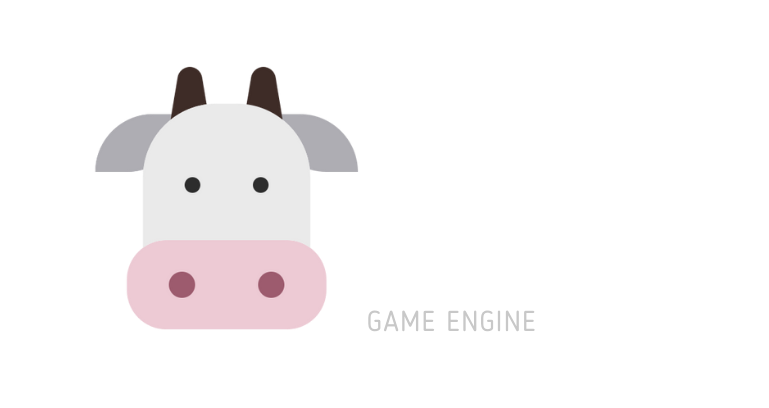

# Gobu Engine

  

[Gobu Engine](https://gobuengine.org) is a cross-platform game engine in development, specifically designed for creating 2D games. Written in C and with a GTK4-based interface, it stands out for its focus on simplifying the user experience. Unlike other 2D engines, Gobu aims to make developers' lives easier by offering tools that eliminate the need for direct programming. It uses predefined components to encompass a wide variety of game types, significantly streamlining the development process.

## Free, Open Source
Gobu is completely free and open source under the MIT license, which is extremely permissive. No strings attached, no royalties, absolutely nothing. Games created by users belong entirely to them.

